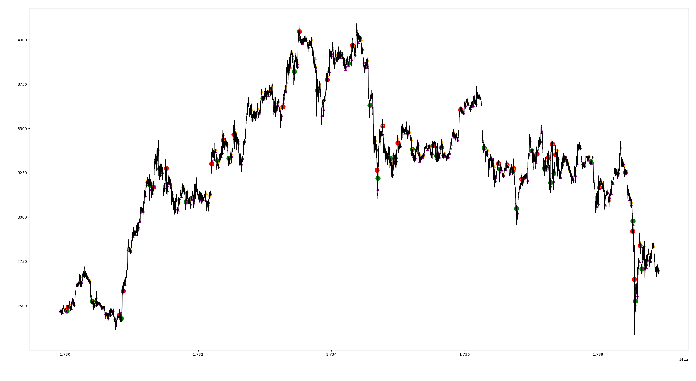

# sabatrade (WIP)

a simple cryptocurrency (can be used for other assets) trading bot which uses several machine learning algorithms in conjunctions with some popular trading indicators (RSI, ATR, SuperTrend, etc.) to attempt to achive profitability. Imagine having passive income souly by runnig a python program.

## ⌨️ usage
It is a simple cli-application with simple functionality. the config file is required to setup the exchange and the desired model parameters. the recommended usage is:

⚪ **Step 1:**  create or load a model

⚪ **Step 2:**  back-test the bot with unseen data to ensure profitability

⚪ **Step 3:**  run the bot and visualize the results real time.

⚪ **Step 4:**  enjoy the rewards (hopefully)

## 📸 screenshots


## 🛠 installation
```bash
git clone https://github.com/sababot/sabatrade
cd sabatrade
pip install -r requirements.txt

# after the exchange and the model parameters are configured
python main.py
```
